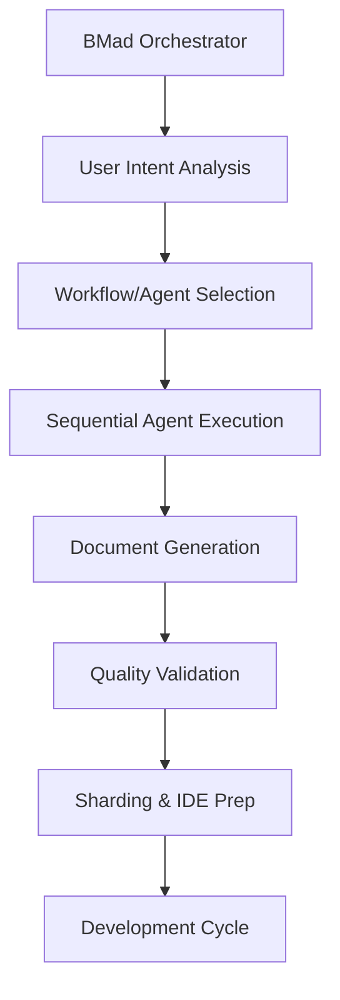

# BMad (Business-Method-Agent-Driven) Project Documentation

## Overview

BMad is a comprehensive **AI-powered software development framework** that orchestrates specialized agents to guide the complete software development lifecycle. The system provides structured workflows for both greenfield (new) and brownfield (existing) projects across full-stack, UI-only, and service-only development scenarios.

## Project Structure

The BMad project is organized as a modular framework located in the `.bmad-core/` directory with the following architecture:

```
.bmad-core/
├── core-config.yaml          # Main project configuration
├── install-manifest.yaml     # Installation tracking and file integrity
├── agents/                   # Specialized AI agent definitions
├── agent-teams/              # Agent team configurations
├── workflows/                # Development workflow definitions
├── templates/                # Document generation templates
├── tasks/                    # Executable task definitions
├── checklists/              # Quality assurance checklists
└── data/                    # Knowledge base and reference data
```

## Core Components and Their Relationships

### 1. Configuration Layer

#### Core Configuration (`core-config.yaml`)
- **Purpose**: Centralized project settings and file paths
- **Key Features**:
  - Markdown processing controls (`markdownExploder: true`)
  - Document versioning (PRD v4, Architecture v4)
  - Sharding configuration for large documents
  - Developer workflow customization
  - Custom slash command prefix (`BMad`)

#### Install Manifest (`install-manifest.yaml`)
- **Purpose**: Version control and integrity tracking
- **Key Features**:
  - BMad version tracking (currently 4.39.2)
  - File hash verification for all framework components
  - IDE integration tracking (Claude Code support)
  - Modification detection system

### 2. Agent System

The BMad framework employs specialized AI agents, each with distinct roles and capabilities:

#### BMad Orchestrator (`agents/bmad-orchestrator.md`)
- **Role**: Master coordinator and entry point
- **Key Features**:
  - Dynamic transformation into any specialized agent
  - Workflow guidance and recommendation
  - Command routing with `*` prefix system
  - Resource loading on-demand (never pre-loads)
  - Interactive help system

#### Core Specialist Agents:
1. **Analyst** (`agents/analyst.md`) - Market research and project brief creation
2. **Product Manager** (`agents/pm.md`) - PRD creation and product strategy
3. **UX Expert** (`agents/ux-expert.md`) - UI/UX specifications and design
4. **Architect** (`agents/architect.md`) - Technical architecture and system design
5. **Developer** (`agents/dev.md`) - Code implementation and technical delivery
6. **Product Owner** (`agents/po.md`) - Requirements validation and quality gates
7. **Scrum Master** (`agents/sm.md`) - Story creation and agile process management
8. **QA** (`agents/qa.md`) - Code review and quality assurance

### 3. Agent Team Configurations

Teams bundle agents and workflows for specific development scenarios:

#### Available Teams:
- **Team All** (`agent-teams/team-all.yaml`) - Complete agent roster
- **Team Fullstack** (`agent-teams/team-fullstack.yaml`) - Web application development
- **Team No UI** (`agent-teams/team-no-ui.yaml`) - Backend/service development
- **Team IDE Minimal** (`agent-teams/team-ide-minimal.yaml`) - Lightweight development setup

### 4. Workflow System

BMad provides six primary workflows covering different development scenarios:

#### Greenfield Workflows (New Projects):
1. **Greenfield Full-Stack** (`workflows/greenfield-fullstack.yaml`)
   - **Sequence**: Analyst → PM → UX Expert → Architect → PO → SM → Dev → QA
   - **Deliverables**: Project brief, PRD, UI spec, architecture, sharded docs, stories
   - **Features**: Optional v0/Lovable AI UI generation integration

2. **Greenfield Service** (`workflows/greenfield-service.yaml`)
   - **Focus**: Backend services and APIs
   - **Excludes**: UI/UX components

3. **Greenfield UI** (`workflows/greenfield-ui.yaml`)
   - **Focus**: Frontend applications
   - **Includes**: Enhanced UX research and design phases

#### Brownfield Workflows (Existing Projects):
4. **Brownfield Full-Stack** (`workflows/brownfield-fullstack.yaml`)
   - **Features**: Existing codebase analysis and integration
   - **Enhanced**: Architecture review and migration planning

5. **Brownfield Service** (`workflows/brownfield-service.yaml`)
   - **Focus**: Extending existing backend systems

6. **Brownfield UI** (`workflows/brownfield-ui.yaml`)
   - **Focus**: Enhancing existing user interfaces

### 5. Template System

The template system uses YAML-driven interactive document generation:

#### Key Templates:
- **PRD Template** (`templates/prd-tmpl.yaml`) - Product Requirements Documents
- **Architecture Templates** - System design specifications
- **Front-end Spec Template** - UI/UX specifications  
- **Story Template** - User story generation
- **Project Brief Template** - Initial project definition

#### Template Features:
- **Interactive Elicitation**: Mandatory user interaction with 9-option choice system
- **Conditional Sections**: Content appears based on project requirements
- **Version Control**: Built-in changelog and versioning
- **Validation**: Integrated quality checks and consistency verification

### 6. Task Execution System

Tasks are executable workflows that agents use to perform specific functions:

#### Core Tasks:
- **Document Creation** (`tasks/create-doc.md`) - Template-driven document generation
- **Story Management** - Story creation, review, and validation
- **Quality Gates** (`tasks/qa-gate.md`) - Quality assurance checkpoints
- **Architecture Development** - Technical specification creation
- **Requirement Tracing** - Requirement validation and tracking

#### Task Features:
- **Elicitation Engine**: Advanced user interaction patterns
- **Step-by-Step Execution**: Mandatory sequential processing
- **Quality Validation**: Built-in consistency checks
- **Agent Permission System**: Role-based access control

### 7. Quality Assurance System

#### Checklists:
- **Product Owner Master Checklist** (`checklists/po-master-checklist.md`)
- **Story Definition of Done** (`checklists/story-dod-checklist.md`)
- **Architect Checklist** (`checklists/architect-checklist.md`)
- **Change Management Checklist** (`checklists/change-checklist.md`)

#### Quality Gates:
- Document consistency validation
- Requirements traceability verification
- Technical architecture review
- Story completeness assessment

### 8. Knowledge Base

The data directory contains reference materials and methodologies:
- **BMad Knowledge Base** (`data/bmad-kb.md`) - Core methodology
- **Elicitation Methods** (`data/elicitation-methods.md`) - User interaction techniques
- **Technical Preferences** (`data/technical-preferences.md`) - Technology selection guidance
- **Testing Frameworks** - Testing strategy and prioritization matrices

## System Integration and Data Flow

### 1. Workflow Execution Pattern:


### 2. Agent Interaction Model:
- **Stateless Agents**: Each agent operates independently with defined inputs/outputs
- **Document Handoffs**: Structured passing of artifacts between agents
- **Quality Gates**: PO validation at key transition points
- **Iterative Refinement**: Feedback loops for continuous improvement

### 3. Document Lifecycle:
1. **Template Selection** - Choose appropriate YAML template
2. **Interactive Generation** - User elicitation and content creation
3. **Validation** - Quality checks and consistency verification
4. **Sharding** - Breaking large documents into manageable pieces
5. **IDE Integration** - Preparing documents for development workflow

## Key Design Principles

### 1. Agent Specialization
- Each agent has clearly defined expertise and responsibilities
- No agent performs tasks outside their domain
- Clear handoff protocols between agents

### 2. Interactive Elicitation
- Mandatory user interaction for critical decisions
- 9-option choice system for consistent UX
- Advanced elicitation methods for complex requirements

### 3. Quality-First Approach
- Multiple validation checkpoints
- Comprehensive checklists for all deliverables
- Requirements traceability throughout lifecycle

### 4. Flexibility and Scalability
- Modular architecture supports different project types
- Configurable workflows and agent teams
- Template-driven customization

### 5. IDE Integration
- Document sharding for manageable development chunks
- Claude Code integration for seamless AI-assisted development
- Workflow state tracking and progress management

## Development Lifecycle Integration

### Phase 1: Planning & Analysis
- **Agents**: Analyst, PM, UX Expert
- **Outputs**: Project brief, PRD, UI specifications
- **Duration**: Planning phase completion

### Phase 2: Architecture & Design
- **Agents**: Architect, PO (validation)
- **Outputs**: Technical architecture, system design
- **Integration**: Optional AI UI generation (v0, Lovable)

### Phase 3: Development Preparation
- **Agents**: PO (sharding), SM (story creation)
- **Outputs**: Sharded documents, user stories
- **Setup**: IDE workspace preparation

### Phase 4: Implementation
- **Agents**: Dev, QA
- **Process**: Iterative story implementation with quality review
- **Outputs**: Working software increments

## Advanced Features

### 1. AI UI Generation Integration
- Seamless integration with v0 and Lovable platforms
- Automatic project structure incorporation
- Architecture alignment with generated UI code

### 2. Document Sharding
- Large document splitting for AI agent consumption
- Maintains context and relationships
- Optimized for IDE development workflow

### 3. Requirements Traceability
- End-to-end requirement tracking
- Impact analysis for changes
- Validation at every workflow stage

### 4. Polyrepo/Monorepo Support
- Flexible repository structure support
- Team coordination across multiple codebases
- Standardized documentation patterns

## Usage Patterns

### For New Projects (Greenfield):
1. Start with BMad Orchestrator (`*help`)
2. Select appropriate workflow (`*workflow greenfield-fullstack`)
3. Follow sequential agent execution
4. Generate and validate all planning documents
5. Transition to IDE development with sharded documents

### For Existing Projects (Brownfield):
1. Use brownfield-specific workflows
2. Enhanced architecture analysis
3. Integration planning with existing systems
4. Incremental enhancement strategies

### For Different Project Types:
- **Web Applications**: Full-stack workflows with UX emphasis
- **APIs/Services**: Service-focused workflows without UI components
- **UI Enhancements**: UI-specific workflows with design focus

## Conclusion

BMad represents a comprehensive framework for AI-assisted software development that bridges the gap between high-level planning and detailed implementation. By providing structured workflows, specialized agents, and quality-focused processes, it enables teams to deliver well-architected, thoroughly planned software projects with consistent documentation and traceability throughout the development lifecycle.

The framework's modular design and extensive customization options make it suitable for diverse development scenarios while maintaining the discipline and quality standards essential for professional software development.