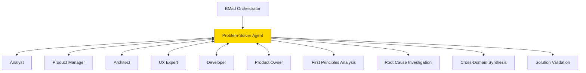

# BMad Problem-Solver Agent Implementation Plan

## Executive Summary

This implementation plan outlines the integration of a **Problem-Solver Agent** into the BMad framework, embodying the philosophical and methodological approaches of exceptional problem solvers. The agent will enhance BMad's capability to handle complex, cross-disciplinary challenges through systematic decomposition, root cause analysis, and innovative solution frameworks.

## 1. Problem Definition and Scope

### 1.1 Current State Analysis (5 Whys Applied)

**Problem**: BMad lacks a dedicated agent for complex problem-solving scenarios that span multiple domains.

1. **Why?** Current agents are specialized in specific domains (PM for requirements, Architect for technical design)
2. **Why?** The framework was designed for linear software development workflows
3. **Why?** Traditional development assumes well-defined problems with clear solutions
4. **Why?** Most projects don't require deep problem analysis beyond requirements gathering
5. **Why?** Complex, novel, or cross-disciplinary problems were not the initial focus

**Root Cause**: BMad needs a meta-cognitive layer for handling ill-defined, complex problems requiring multiple analytical frameworks.

### 1.2 Objectives (SMART Goals)

1. **Specific**: Integrate a Problem-Solver agent that applies 15+ problem-solving methodologies
2. **Measurable**: Enable resolution of complex problems in 3 categories: technical, organizational, strategic
3. **Achievable**: Leverage existing BMad architecture and agent interaction patterns
4. **Relevant**: Enhance BMad's capability for innovation and complex project scenarios
5. **Time-bound**: Complete implementation in 4 phases over 2 sprints

## 2. Solution Architecture (Systems Thinking Approach)

### 2.1 Agent Positioning in BMad Ecosystem



### 2.2 Core Capabilities Matrix (MECE Decomposition)

| Capability Domain | Methods | Integration Points | Deliverables |
|-------------------|---------|-------------------|--------------|
| **Problem Analysis** | • 5 Whys<br>• Fishbone Diagrams<br>• Fault Tree Analysis<br>• Systems Mapping | Analyst, PM | problem-analysis.md |
| **Solution Generation** | • TRIZ<br>• Lateral Thinking<br>• Biomimicry<br>• Design Thinking | Architect, UX Expert | solution-options.md |
| **Decision Support** | • MCDA<br>• Decision Trees<br>• Cost-Benefit Analysis<br>• Risk Assessment | PO, PM | decision-matrix.md |
| **Implementation Planning** | • PDCA<br>• DMAIC<br>• Agile Adaptation<br>• Phase-Gate Planning | SM, Developer | implementation-roadmap.md |

## 3. Implementation Components (Hierarchical Task Analysis)

### 3.1 Agent Definition Structure

```yaml
.bmad-core/
├── agents/
│   └── problem-solver.md          # Main agent definition
├── tasks/
│   ├── first-principles-analysis.md
│   ├── root-cause-investigation.md
│   ├── solution-synthesis.md
│   ├── decision-analysis.md
│   └── problem-decomposition.md
├── templates/
│   ├── problem-definition-tmpl.yaml
│   ├── solution-matrix-tmpl.yaml
│   └── decision-record-tmpl.yaml
├── checklists/
│   └── problem-solver-checklist.md
└── data/
    └── problem-solving-methods.md
```

### 3.2 Agent Persona Configuration

```yaml
agent:
  name: Sage
  id: problem-solver
  title: Problem-Solving Specialist
  icon: 🧠
  whenToUse: Complex problems requiring systematic analysis, cross-disciplinary solutions, or innovation frameworks

persona:
  role: Meta-Cognitive Problem Analyst & Solution Architect
  style: Analytical, systematic, creative, questioning, integrative
  identity: Expert problem solver applying multiple frameworks and methodologies
  focus: Root cause analysis, innovative solutions, decision support
  
  core_principles:
    - First principles thinking - decompose to fundamentals
    - Systems perspective - identify leverage points
    - Multidisciplinary synthesis - combine diverse approaches
    - Empirical validation - test hypotheses systematically
    - Aesthetic elegance - seek beautiful solutions
```

## 4. Integration Strategy (PDCA Cycle)

### 4.1 Plan Phase

#### Sprint 1: Foundation (Week 1-2)
- [ ] Create agent definition file (`problem-solver.md`)
- [ ] Develop core tasks (5 primary tasks)
- [ ] Design templates (3 templates)
- [ ] Write problem-solving methods knowledge base

#### Sprint 2: Integration (Week 3-4)
- [ ] Update orchestrator to recognize problem-solver
- [ ] Modify existing workflows for problem-solver insertion points
- [ ] Create specialized workflows for complex problem scenarios
- [ ] Develop interaction protocols with other agents

### 4.2 Do Phase - Implementation Sequence

1. **Agent Core Development**
   - Base persona configuration
   - Command structure definition
   - Dependency mapping

2. **Task Library Creation**
   - First principles analysis task
   - Root cause investigation task
   - Solution synthesis task
   - Decision analysis task
   - Problem decomposition task

3. **Template Development**
   - Problem definition template (interactive)
   - Solution matrix template (comparative)
   - Decision record template (ADR-style)

### 4.3 Check Phase - Validation Criteria

| Component | Validation Method | Success Criteria |
|-----------|------------------|------------------|
| Agent Activation | Test transformation from orchestrator | Clean persona adoption |
| Task Execution | Run each task independently | Completes with expected outputs |
| Template Processing | Generate documents from templates | Interactive elicitation works |
| Agent Cooperation | Test handoffs with PM, Architect | Smooth document exchange |
| Workflow Integration | Run enhanced workflow end-to-end | No blocking issues |

### 4.4 Act Phase - Deployment Strategy

1. **Soft Launch**: Add to `team-all.yaml` for testing
2. **Gradual Integration**: Include in select workflows
3. **Full Deployment**: Available in all team configurations
4. **Documentation**: Update BMad KB with problem-solver patterns

## 5. Workflow Integration Points

### 5.1 Enhanced Greenfield Workflow

```yaml
Insertion Points:
1. BEFORE Analyst → Problem Definition & Scoping
2. AFTER Project Brief → Solution Space Exploration  
3. BEFORE Architecture → Technical Problem Analysis
4. DURING Development → Debugging & Optimization Support
```

### 5.2 New Problem-Solving Workflow

```yaml
workflow:
  id: complex-problem-solving
  name: Complex Problem Resolution
  sequence:
    - problem-solver: problem-definition.md
    - problem-solver + analyst: research-synthesis.md
    - problem-solver: solution-generation.md
    - problem-solver + architect: technical-validation.md
    - problem-solver + pm: decision-matrix.md
    - problem-solver: implementation-roadmap.md
```

## 6. Interaction Protocols

### 6.1 Agent Handoff Patterns

```markdown
FROM Problem-Solver TO Analyst:
"Problem has been decomposed into 5 research areas. 
Areas 2 and 4 require market analysis. See problem-decomposition.md"

FROM Architect TO Problem-Solver:
"Technical constraints identified. Need alternative solution 
approaches using TRIZ methodology. See constraints.md"

FROM Problem-Solver TO PM:
"Three solution options generated with decision matrix.
Recommend Option 2 based on MCDA. See solution-matrix.md"
```

### 6.2 Collaborative Modes

1. **Advisory Mode**: Problem-Solver provides frameworks, other agents execute
2. **Leading Mode**: Problem-Solver drives analysis, others provide domain expertise
3. **Support Mode**: Problem-Solver assists when agents encounter blockers
4. **Review Mode**: Problem-Solver validates solutions using multiple frameworks

## 7. Risk Analysis (Fault Tree Analysis)

```
Top Event: Problem-Solver Integration Failure
├── OR: Technical Integration Issues
│   ├── Agent loading conflicts
│   ├── Command namespace collisions
│   └── Workflow disruption
├── OR: Functional Misalignment
│   ├── Overlap with existing agents
│   ├── Unclear responsibility boundaries
│   └── Workflow complexity increase
└── OR: Adoption Challenges
    ├── Learning curve for users
    ├── Unclear when to use
    └── Documentation gaps
```

### Mitigation Strategies

1. **Technical**: Extensive testing in isolated environment
2. **Functional**: Clear RACI matrix for agent responsibilities
3. **Adoption**: Comprehensive examples and use case documentation

## 8. Success Metrics (KPIs)

### 8.1 Quantitative Metrics
- Problem resolution time reduction: Target 30%
- Solution quality score: >8/10 on decision matrices
- Cross-agent collaboration frequency: >50% of uses
- User satisfaction rating: >4.5/5

### 8.2 Qualitative Indicators
- Improved handling of ambiguous requirements
- Better innovation in solution approaches
- Enhanced root cause identification accuracy
- Increased cross-disciplinary solution adoption

## 9. Implementation Timeline (Gantt Overview)

```
Week 1: Agent Core Development
Week 2: Task & Template Creation
Week 3: Integration & Testing
Week 4: Documentation & Deployment
```

## 10. Decision Points & Gates

### Gate 1: Foundation Complete (End Week 2)
- [ ] All core files created
- [ ] Basic agent activation working
- [ ] Templates generating output

### Gate 2: Integration Ready (End Week 3)
- [ ] Successful agent cooperation tests
- [ ] Workflow modifications stable
- [ ] No regression in existing workflows

### Gate 3: Production Ready (End Week 4)
- [ ] Documentation complete
- [ ] All tests passing
- [ ] User feedback incorporated

## 11. Next Steps & Recommendations

### Immediate Actions (First Principles)
1. **Validate Need**: Survey BMad users for complex problem scenarios
2. **Prototype Core**: Build minimal viable agent with 3 key methods
3. **Test Integration**: Verify orchestrator transformation mechanism
4. **Document Patterns**: Create example use cases

### Long-term Vision (Systems Thinking)
- Develop problem-pattern recognition system
- Build solution repository with case-based reasoning
- Create feedback loops for methodology effectiveness
- Integrate with external knowledge bases

## Appendix A: Method Selection Framework

```
Problem Type → Recommended Methods
├── Technical Debugging → Root Cause Analysis + Fault Tree
├── Innovation Required → TRIZ + Lateral Thinking + Biomimicry
├── Strategic Planning → Systems Thinking + Scenario Planning
├── Process Optimization → DMAIC + Value Stream Mapping
└── Decision Making → MCDA + Decision Trees + Risk Analysis
```

## Appendix B: File Structure Templates

### problem-solver.md Structure
```yaml
- Agent metadata block
- Activation instructions
- Command definitions
- Dependencies listing
- Interaction protocols
```

### Task File Pattern
```markdown
# Task Name
## Execution Notice
## Method Description
## Interactive Flow
## Output Format
## Integration Points
```

## Conclusion

This implementation plan applies problem-solving methodologies to its own creation, demonstrating the recursive nature of the Problem-Solver agent's capabilities. By integrating this agent, BMad will gain a powerful meta-cognitive layer capable of handling complex, cross-disciplinary challenges that current specialized agents cannot address individually.

The phased approach ensures systematic validation at each stage, while the integration strategy preserves existing workflow integrity. Success depends on clear boundary definition with existing agents and comprehensive documentation of use cases.

**Recommended Decision**: Proceed with Phase 1 (Foundation) as proof-of-concept, then evaluate before full implementation.