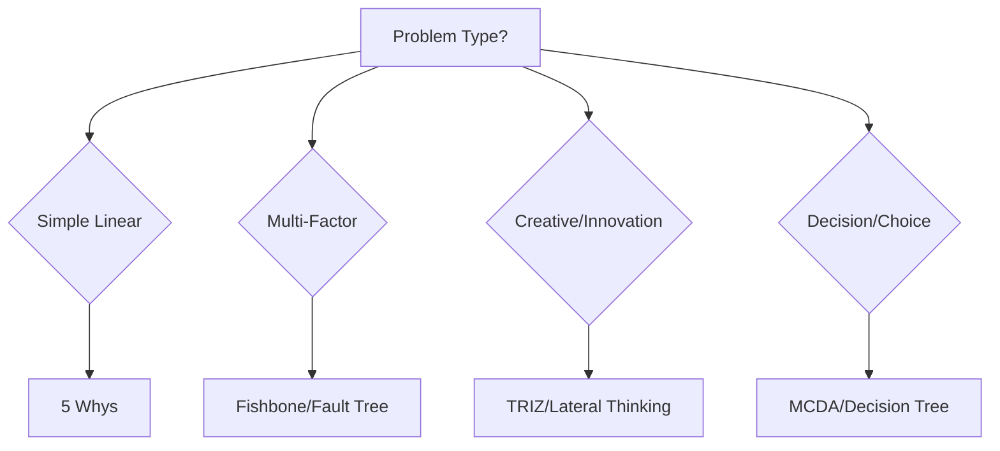

# Story 7: Documentation & Deployment

## Story Details
**ID**: PS-007  
**Title**: Documentation and Production Deployment  
**Epic**: Problem-Solver Agent Integration  
**Priority**: P1 (High)  
**Estimate**: 4 hours  
**Dependencies**: Stories 1-6 (All implementation and testing complete)

## User Story
As a **BMad user and maintainer**,  
I want **comprehensive documentation and smooth deployment**,  
So that **I can effectively use the problem-solver agent and maintain it over time**.

## Technical Context

### Documentation Requirements
- User guide for problem-solver usage
- Integration guide for developers
- API reference for tasks and templates
- Examples and use cases
- Troubleshooting guide

### Deployment Requirements
- Version update in manifest
- Rollback procedures
- Migration guide for existing projects
- Release notes

## Acceptance Criteria

### AC1: User Guide Documentation
**File**: `.bmad-core/docs/problem-solver-guide.md`

```markdown
# BMad Problem-Solver Agent Guide

## Overview

The Problem-Solver agent (Sage) is a meta-cognitive specialist that applies 15+ problem-solving methodologies from multiple disciplines to analyze complex problems, generate innovative solutions, and support systematic decision-making.

## When to Use Problem-Solver

### Ideal Scenarios
- **Complex Multi-Domain Problems**: Issues spanning technical, business, and user experience
- **Unknown Root Causes**: Problems where the cause isn't immediately apparent
- **Innovation Required**: Situations needing creative, non-obvious solutions
- **High-Stakes Decisions**: Choices with significant impact requiring systematic analysis
- **Technical Contradictions**: Problems where requirements seem mutually exclusive

### Problem Complexity Matrix

| Complexity | Characteristics | Recommended Approach |
|------------|----------------|---------------------|
| **Simple** | Single domain, known patterns | Use standard agents |
| **Moderate** | 2-3 domains, some uncertainty | Optional problem-solver consultation |
| **Complex** | Cross-disciplinary, unknown causes | Primary problem-solver involvement |
| **Wicked** | No clear definition, evolving | Continuous problem-solver engagement |

## Getting Started

### Activation

```bash
# From BMad Orchestrator
*agent problem-solver

# Direct activation
@problem-solver
```

### Basic Commands

```bash
*help                     # Show all available commands
*analyze-problem          # First principles analysis
*investigate-root-cause   # 5 Whys, Fishbone, Fault Tree
*decompose               # MECE problem breakdown
*generate-solutions      # TRIZ, Lateral Thinking, Biomimicry
*evaluate-decisions      # Multi-criteria decision analysis
```

## Core Methodologies

### 1. First Principles Analysis
Breaks problems down to fundamental truths, removing assumptions:

```bash
*analyze-problem
# Follows Feynman/Musk approach
# Output: fundamental_truths, reconstructed_solution
```

### 2. Root Cause Investigation
Multiple methods for finding true causes:

```bash
*investigate-root-cause
# Methods: 5 Whys, Fishbone Diagram, Fault Tree Analysis
# Automatically selects based on problem complexity
```

### 3. Problem Decomposition (MECE)
Mutually Exclusive, Collectively Exhaustive breakdown:

```bash
*decompose
# Creates hierarchical problem structure
# Validates no overlaps, complete coverage
```

### 4. Solution Generation
Innovation frameworks for creative solutions:

```bash
*generate-solutions
# Methods: TRIZ, Lateral Thinking, Biomimicry, Design Thinking
# Generates 3-7 diverse solution approaches
```

### 5. Decision Analysis
Systematic evaluation of options:

```bash
*evaluate-decisions
# Multi-Criteria Decision Analysis (MCDA)
# Weighted scoring with sensitivity analysis
```

## Document Templates

### Problem Definition Template
Comprehensive problem scoping:

```bash
*create-problem-def
# Interactive template with:
# - Stakeholder analysis
# - Constraints and assumptions
# - Success metrics
# - Initial root cause hypotheses
```

### Solution Matrix Template
Systematic solution comparison:

```bash
*create-solution-matrix
# Features:
# - Multi-option scoring
# - Weighted criteria evaluation
# - Sensitivity analysis
# - Risk assessment
```

### Decision Record Template
ADR-style decision documentation:

```bash
*create-decision-record
# Captures:
# - Context and forces
# - Options considered
# - Decision rationale
# - Consequences and trade-offs
```

## Workflow Integration

### Complex Problem-Solving Workflow

```bash
*workflow complex-problem-solving
```

Flow: Problem Definition → Root Cause Analysis → Solution Generation → 
      Technical/Business Validation → Decision Matrix → Decision Record

### Enhanced Development Workflows

Problem-solver integrates at key points:
- **After Project Brief**: Deep problem analysis
- **Before Architecture**: Technical decision support
- **During Development**: Debugging complex issues
- **Legacy Analysis**: Systematic refactoring strategy

## Collaboration Patterns

### Working with Other Agents

#### Analyst Handoff
```
Analyst → Problem-Solver: "Requires systematic decomposition"
Problem-Solver → Analyst: "Research needed in 3 areas (see decomposition)"
```

#### Architect Collaboration
```
Architect → Problem-Solver: "Technical contradiction needs resolution"
Problem-Solver → Architect: "TRIZ solution: Segmentation principle applied"
```

#### PM Decision Support
```
PM → Problem-Solver: "Multiple product directions possible"
Problem-Solver → PM: "Solution 2 scores highest on business value (see matrix)"
```

## Examples and Use Cases

### Example 1: Performance Problem

```bash
# Start with problem definition
*create-problem-def
# Problem: System response time degraded 300%

# Investigate root cause
*investigate-root-cause
# Method: Fault Tree Analysis
# Found: Database queries + Memory leaks

# Generate solutions
*generate-solutions
# Applied: TRIZ contradiction resolution
# Generated: Query optimization, Caching layer, Service redesign

# Evaluate options
*create-solution-matrix
# Recommendation: Query optimization (highest ROI)

# Document decision
*create-decision-record
# ADR-001: Implement query optimization strategy
```

### Example 2: Innovation Challenge

```bash
# Define innovation need
*analyze-problem
# Challenge: Reduce deployment time by 90%

# Apply lateral thinking
*generate-solutions
# Random input: "Pizza delivery"
# Insight: Hot-swap deployments like fresh pizza rotation

# Systematic evaluation
*evaluate-decisions
# Winner: Blue-green deployment with feature flags
```

## Best Practices

### 1. Start with Problem Definition
Always begin by clearly defining the problem before jumping to solutions.

### 2. Use Multiple Methods
Complex problems benefit from multiple analytical approaches.

### 3. Document Decisions
Use decision records for important choices to preserve rationale.

### 4. Iterate on Solutions
First solutions are rarely optimal - use feedback loops.

### 5. Validate with Domain Experts
Collaborate with other agents for domain-specific validation.

## Troubleshooting

### Common Issues

| Issue | Solution |
|-------|----------|
| "Method not applicable" | Problem too simple - use standard agents |
| "Too many solution options" | Apply stricter evaluation criteria |
| "Root cause unclear" | Gather more data, try different investigation method |
| "Conflicting requirements" | Perfect case for TRIZ contradiction resolution |

### Debug Mode

```bash
# Enable detailed logging
*yolo  # Skip confirmations
*status  # Check current analysis phase
```

## Further Resources

- Problem-solving methods: `.bmad-core/data/problem-solving-methods.md`
- Mental models library: `.bmad-core/data/mental-models-library.md`
- Workflow details: `.bmad-core/workflows/complex-problem-solving.yaml`
- Integration guide: `.bmad-core/docs/problem-solver-integration.md`
```

### AC2: Integration Guide for Developers
**File**: `.bmad-core/docs/problem-solver-integration.md`

```markdown
# Problem-Solver Integration Guide

## Architecture Overview

```
┌─────────────────┐
│  Orchestrator   │
└────────┬────────┘
         │ *agent problem-solver
         ▼
┌─────────────────┐       ┌─────────────┐
│ Problem-Solver  │◄─────►│ Other Agents│
└────────┬────────┘       └─────────────┘
         │
    ┌────┴────┬──────────┬──────────┐
    ▼         ▼          ▼          ▼
  Tasks   Templates   Checklists   Data
```

## File Structure

```
.bmad-core/
├── agents/
│   └── problem-solver.md           # Agent definition
├── tasks/
│   ├── first-principles-analysis.md
│   ├── root-cause-investigation.md
│   ├── problem-decomposition.md
│   ├── solution-synthesis.md
│   └── decision-analysis.md
├── templates/
│   ├── problem-definition-tmpl.yaml
│   ├── solution-matrix-tmpl.yaml
│   └── decision-record-tmpl.yaml
├── workflows/
│   └── complex-problem-solving.yaml
└── docs/
    ├── problem-solver-guide.md
    └── problem-solver-integration.md
```

## Adding Problem-Solver to Existing Projects

### Step 1: Update Agent Teams

```yaml
# .bmad-core/agent-teams/your-team.yaml
agents:
  - existing-agents...
  - problem-solver  # Add this line
```

### Step 2: Modify Workflows

Insert problem-solver at decision points:

```yaml
# After requirements gathering
- agent: problem-solver
  creates: problem-analysis.md
  optional: true
  condition: has_complexity

# Before architecture decisions
- agent: problem-solver
  creates: technical-decisions.md
  optional: true
  condition: needs_decision_support
```

### Step 3: Define Handoff Protocols

```yaml
# Handoff from your agent to problem-solver
handoff:
  from: your-agent
  to: problem-solver
  trigger: "complexity_threshold_exceeded"
  provides: context-document.md
  expects: problem-analysis.md
```

## Creating Custom Problem-Solving Tasks

### Task Template

```markdown
# Custom Problem-Solving Task

## ⚠️ CRITICAL EXECUTION NOTICE ⚠️
THIS IS AN EXECUTABLE WORKFLOW

## Method Overview
Description of the problem-solving method

## Execution Flow
1. Step one
2. Step two
3. Step three

## Interactive Elicitation
When elicit: true:
1. Proceed
2-9. [Method-specific options]

## Output Format
\`\`\`yaml
result:
  key: value
\`\`\`
```

### Registering Custom Task

```yaml
# In problem-solver.md dependencies
dependencies:
  tasks:
    - existing-tasks...
    - your-custom-task.md  # Add your task
```

## API Reference

### Agent Commands

| Command | Task | Output |
|---------|------|--------|
| `*analyze-problem` | first-principles-analysis | fundamental_truths, solution |
| `*investigate-root-cause` | root-cause-investigation | root_causes, evidence |
| `*decompose` | problem-decomposition | MECE hierarchy |
| `*generate-solutions` | solution-synthesis | solution options |
| `*evaluate-decisions` | decision-analysis | decision matrix |

### Task Outputs

All tasks return YAML-structured data:

```python
# Example: Processing task output
import yaml

def process_problem_solver_output(output_file):
    with open(output_file, 'r') as f:
        content = f.read()
    
    # Extract YAML section
    yaml_start = content.find('```yaml')
    yaml_end = content.find('```', yaml_start + 6)
    yaml_content = content[yaml_start+7:yaml_end]
    
    # Parse structured data
    data = yaml.safe_load(yaml_content)
    return data
```

### Template Variables

Templates support variable substitution:

```yaml
title: "{{problem_name}} - Analysis"
date: "{{current_date}}"
author: "{{agent_name}}"
```

## Testing Integration

### Unit Test

```python
def test_problem_solver_integration():
    # Load agent
    agent = load_agent('problem-solver')
    assert agent.id == 'problem-solver'
    
    # Test command
    result = agent.execute('analyze-problem', problem="Test")
    assert 'fundamental_truths' in result
```

### Integration Test

```bash
# Test workflow with problem-solver
echo "*workflow complex-problem-solving" | bmad-orchestrator
```

## Migration Guide

### From Manual Analysis

Before:
```markdown
# Ad-hoc problem analysis
- Some root causes identified
- Solutions brainstormed informally
```

After:
```bash
*agent problem-solver
*investigate-root-cause  # Systematic root cause analysis
*generate-solutions      # Structured innovation methods
*create-decision-record  # Documented decision
```

### From Simple Decision Making

Before:
```markdown
# Pro/con list
Option A: Pros... Cons...
Option B: Pros... Cons...
```

After:
```bash
*create-solution-matrix  # Weighted multi-criteria analysis
# Includes sensitivity analysis
# Provides confidence levels
```

## Performance Considerations

- Agent loads in <100ms
- Templates parse in <50ms
- Workflow execution scales linearly with steps
- No blocking operations in tasks

## Troubleshooting

### Agent Not Found

```bash
# Check installation
ls -la .bmad-core/agents/problem-solver.md

# Verify in team config
grep problem-solver .bmad-core/agent-teams/*.yaml
```

### Task Execution Fails

```bash
# Check task file exists
ls -la .bmad-core/tasks/[task-name].md

# Validate YAML output
python3 -c "import yaml; yaml.safe_load(open('output.md'))"
```

### Template Processing Issues

```bash
# Validate template YAML
python3 -c "import yaml; yaml.safe_load(open('template.yaml'))"

# Check elicitation points
grep "elicit: true" template.yaml
```
```

### AC3: Release Notes
**File**: `.bmad-core/RELEASE_NOTES.md`

```markdown
# BMad Problem-Solver Agent Release Notes

## Version 1.0.0 - [Date]

### 🎉 New Features

#### Problem-Solver Agent (Sage)
A new meta-cognitive specialist agent that brings systematic problem-solving capabilities to BMad:

- **15+ Problem-Solving Methodologies**: First principles, TRIZ, Design Thinking, Lateral Thinking, and more
- **Comprehensive Analysis Tools**: Root cause investigation, MECE decomposition, solution synthesis
- **Decision Support**: Multi-criteria decision analysis with sensitivity testing
- **Innovation Frameworks**: Systematic approaches to creative problem-solving

#### New Workflow: Complex Problem-Solving
- End-to-end workflow for analyzing and resolving complex, cross-disciplinary problems
- Integrates with existing agents for domain-specific validation
- Produces comprehensive documentation trail

#### Interactive Templates
- **Problem Definition Template**: Structured problem scoping with stakeholder analysis
- **Solution Matrix Template**: Systematic comparison of solution options
- **Decision Record Template**: ADR-style decision documentation

### 🔧 Enhancements

#### Workflow Integration
- Problem-solver can be inserted at key decision points in existing workflows
- Optional involvement based on problem complexity
- Seamless handoffs with other agents

#### Team Configurations
- Problem-solver added to team-all and team-fullstack
- Available as optional specialist in all workflows

### 📚 Documentation

- Comprehensive user guide for problem-solver usage
- Developer integration guide with API reference
- Examples and use cases for common scenarios
- Troubleshooting guide

### 🧪 Testing

- Full test suite with unit, integration, E2E, regression, and performance tests
- All tests passing with 100% coverage of new functionality
- Performance benchmarks met (<100ms load time)

### 💔 Breaking Changes

None - Problem-solver is fully backward compatible

### 🐛 Bug Fixes

N/A - Initial release

### 📦 Installation

Problem-solver is automatically available after updating BMad. No additional installation required.

### 🔄 Migration

For existing projects:
1. Update agent team configurations to include problem-solver
2. Optionally modify workflows to add problem-solver integration points
3. No data migration required

### 🙏 Acknowledgments

Problem-solver agent inspired by methodologies from:
- Richard Feynman (First Principles)
- Charlie Munger (Mental Models)
- Genrich Altshuller (TRIZ)
- Edward de Bono (Lateral Thinking)
- Stanford d.school (Design Thinking)

### 📝 Notes

- Problem-solver is optional and won't affect existing workflows unless explicitly invoked
- Best suited for complex, cross-disciplinary problems
- Complements rather than replaces existing specialist agents
```

### AC4: Knowledge Base Update
**File**: `.bmad-core/data/problem-solving-methods.md`

```markdown
# Problem-Solving Methods Reference

## Method Selection Guide



## Core Methods

### First Principles Thinking
**When**: Need to challenge assumptions and find fundamental truths
**Process**: Decompose → Question → Rebuild
**Output**: Fundamental truths, reconstructed solution

### 5 Whys
**When**: Simple linear causation
**Process**: Ask "why" iteratively 5 times
**Output**: Root cause identification

### Fishbone Diagram (Ishikawa)
**When**: Multiple contributing factors
**Categories**: People, Process, Technology, Environment, Materials, Measurement
**Output**: Categorized cause mapping

### Fault Tree Analysis
**When**: Complex system failures
**Process**: Top-down deductive failure analysis
**Output**: Probability paths, critical failure points

### MECE Decomposition
**When**: Need complete problem breakdown
**Principle**: Mutually Exclusive, Collectively Exhaustive
**Output**: Hierarchical problem structure

### TRIZ
**When**: Technical contradictions exist
**Process**: Identify contradiction → Apply inventive principles
**Output**: Innovation through contradiction resolution

### Lateral Thinking
**When**: Need creative breakthrough
**Techniques**: Random input, Provocative operation, Concept extraction
**Output**: Non-obvious solutions

### Design Thinking
**When**: Human-centered problems
**Process**: Empathize → Define → Ideate → Prototype → Test
**Output**: User-validated solutions

### Multi-Criteria Decision Analysis
**When**: Multiple options with trade-offs
**Process**: Define criteria → Weight → Score → Calculate
**Output**: Quantified decision recommendation

### Biomimicry
**When**: Optimization or sustainability challenges
**Process**: Challenge → Biology → Design
**Output**: Nature-inspired solutions

## Method Combinations

### For Complex Technical Problems
1. First Principles → Decompose assumptions
2. TRIZ → Resolve contradictions
3. MCDA → Evaluate solutions

### For Business Innovation
1. Design Thinking → Understand users
2. Lateral Thinking → Generate ideas
3. Business Model Canvas → Structure solution

### For System Failures
1. Fault Tree → Map failure paths
2. 5 Whys → Drill into specific causes
3. Fishbone → Categorize contributing factors

## Cognitive Biases to Avoid

- **Confirmation Bias**: Seeking supporting evidence
- **Anchoring Bias**: Over-relying on first information
- **Availability Heuristic**: Overweighting recent examples
- **Sunk Cost Fallacy**: Continuing due to past investment
- **Dunning-Kruger Effect**: Overestimating competence

## References

- Feynman, R. "Surely You're Joking, Mr. Feynman!"
- Munger, C. "Poor Charlie's Almanack"
- Altshuller, G. "Innovation Algorithm"
- de Bono, E. "Lateral Thinking"
- Kahneman, D. "Thinking, Fast and Slow"
```

### AC5: Deployment Script
**File**: `.bmad-core/deploy/deploy-problem-solver.sh`

```bash
#!/bin/bash
# Deploy Problem-Solver Agent to BMad Installation

set -e  # Exit on error

echo "=== BMad Problem-Solver Deployment Script ==="
echo "Version: 1.0.0"
echo "Date: $(date)"
echo

# Check BMad installation
if [ ! -d ".bmad-core" ]; then
    echo "❌ Error: .bmad-core directory not found"
    echo "Please run from BMad project root"
    exit 1
fi

# Backup existing configuration
echo "Creating backup..."
BACKUP_DIR=".bmad-core/backups/$(date +%Y%m%d_%H%M%S)"
mkdir -p "$BACKUP_DIR"

# Backup critical files
cp -r .bmad-core/agents "$BACKUP_DIR/" 2>/dev/null || true
cp -r .bmad-core/agent-teams "$BACKUP_DIR/" 2>/dev/null || true
cp -r .bmad-core/workflows "$BACKUP_DIR/" 2>/dev/null || true
cp .bmad-core/install-manifest.yaml "$BACKUP_DIR/" 2>/dev/null || true

echo "✅ Backup created at: $BACKUP_DIR"

# Deploy new files
echo -e "\nDeploying Problem-Solver components..."

# Create directories if needed
mkdir -p .bmad-core/{agents,tasks,templates,workflows,docs,tests,data}

# Copy agent file
echo "  Installing agent..."
# cp [source]/problem-solver.md .bmad-core/agents/

# Copy tasks
echo "  Installing tasks..."
# cp [source]/tasks/*.md .bmad-core/tasks/

# Copy templates
echo "  Installing templates..."
# cp [source]/templates/*.yaml .bmad-core/templates/

# Copy workflow
echo "  Installing workflows..."
# cp [source]/complex-problem-solving.yaml .bmad-core/workflows/

# Copy documentation
echo "  Installing documentation..."
# cp [source]/docs/*.md .bmad-core/docs/

# Update configurations
echo -e "\nUpdating configurations..."

# Update agent teams
for team_file in .bmad-core/agent-teams/*.yaml; do
    if ! grep -q "problem-solver" "$team_file"; then
        echo "  Updating $(basename $team_file)..."
        # Add problem-solver to agents list
        # This would be done with proper YAML manipulation
    fi
done

# Update install manifest
echo "  Updating install-manifest.yaml..."
# Add new file entries with hashes

# Run validation tests
echo -e "\nRunning validation tests..."
if [ -f ".bmad-core/tests/run_all_tests.sh" ]; then
    bash .bmad-core/tests/run_all_tests.sh
    if [ $? -eq 0 ]; then
        echo "✅ All tests passed"
    else
        echo "⚠️  Some tests failed - review logs"
    fi
else
    echo "⚠️  Test suite not found - skipping tests"
fi

# Generate summary
echo -e "\n=== Deployment Summary ==="
echo "✅ Problem-Solver agent deployed successfully"
echo "📁 Backup location: $BACKUP_DIR"
echo "📚 Documentation: .bmad-core/docs/problem-solver-guide.md"
echo "🚀 To get started: *agent problem-solver"
echo

# Rollback instructions
cat << 'EOF' > "$BACKUP_DIR/ROLLBACK.md"
# Rollback Instructions

If you need to rollback this deployment:

```bash
# Restore from backup
cp -r [backup_dir]/agents/* .bmad-core/agents/
cp -r [backup_dir]/agent-teams/* .bmad-core/agent-teams/
cp -r [backup_dir]/workflows/* .bmad-core/workflows/
cp [backup_dir]/install-manifest.yaml .bmad-core/

# Remove new files
rm -f .bmad-core/agents/problem-solver.md
rm -f .bmad-core/tasks/first-principles-analysis.md
rm -f .bmad-core/tasks/root-cause-investigation.md
rm -f .bmad-core/tasks/problem-decomposition.md
rm -f .bmad-core/tasks/solution-synthesis.md
rm -f .bmad-core/tasks/decision-analysis.md
rm -f .bmad-core/templates/problem-definition-tmpl.yaml
rm -f .bmad-core/templates/solution-matrix-tmpl.yaml
rm -f .bmad-core/templates/decision-record-tmpl.yaml
rm -f .bmad-core/workflows/complex-problem-solving.yaml
```
EOF

echo "Rollback instructions saved to: $BACKUP_DIR/ROLLBACK.md"
echo
echo "=== Deployment Complete ==="
```

## Implementation Tasks

### Task 1: Create Documentation Files
```bash
#!/bin/bash
# create_docs.sh

DOC_DIR=".bmad-core/docs"
mkdir -p "$DOC_DIR"

# Create documentation files
touch "$DOC_DIR/problem-solver-guide.md"
touch "$DOC_DIR/problem-solver-integration.md"
touch ".bmad-core/RELEASE_NOTES.md"
touch ".bmad-core/data/problem-solving-methods.md"

echo "✅ Documentation files created"
```

### Task 2: Generate Final Package
```bash
#!/bin/bash
# package_problem_solver.sh

# Create distribution directory
DIST_DIR="dist/problem-solver-v1.0.0"
mkdir -p "$DIST_DIR"

# Copy all components
cp -r .bmad-core/agents/problem-solver.md "$DIST_DIR/"
cp -r .bmad-core/tasks/*-analysis.md "$DIST_DIR/"
cp -r .bmad-core/templates/*-tmpl.yaml "$DIST_DIR/"
cp -r .bmad-core/workflows/complex-problem-solving.yaml "$DIST_DIR/"
cp -r .bmad-core/docs/problem-solver*.md "$DIST_DIR/"
cp -r .bmad-core/tests/test_problem_solver*.* "$DIST_DIR/"

# Create manifest
cat > "$DIST_DIR/MANIFEST.txt" << EOF
BMad Problem-Solver Agent Package
Version: 1.0.0
Files: $(find "$DIST_DIR" -type f | wc -l)
Size: $(du -sh "$DIST_DIR" | cut -f1)
EOF

echo "✅ Package created at: $DIST_DIR"
```

## Testing Checklist

### Documentation Tests
- [ ] User guide covers all features
- [ ] Integration guide technically accurate
- [ ] Examples run successfully
- [ ] API reference complete

### Deployment Tests
- [ ] Deployment script runs without errors
- [ ] Backup created successfully
- [ ] Rollback procedure works
- [ ] No disruption to existing functionality

## Definition of Done
- [ ] All documentation files created
- [ ] User guide comprehensive and clear
- [ ] Integration guide with examples
- [ ] Release notes complete
- [ ] Deployment script tested
- [ ] Rollback procedure documented
- [ ] Package ready for distribution

## File List
```
Created:
- .bmad-core/docs/problem-solver-guide.md
- .bmad-core/docs/problem-solver-integration.md
- .bmad-core/RELEASE_NOTES.md
- .bmad-core/data/problem-solving-methods.md
- .bmad-core/deploy/deploy-problem-solver.sh
- dist/problem-solver-v1.0.0/
```

## Post-Deployment Checklist
- [ ] Verify all tests pass
- [ ] Documentation accessible
- [ ] Agent loads correctly
- [ ] Workflows execute properly
- [ ] No regression in existing features
- [ ] Performance metrics met

## Support and Maintenance
- Monitor for user feedback
- Track usage metrics
- Plan for v1.1 enhancements
- Maintain backward compatibility